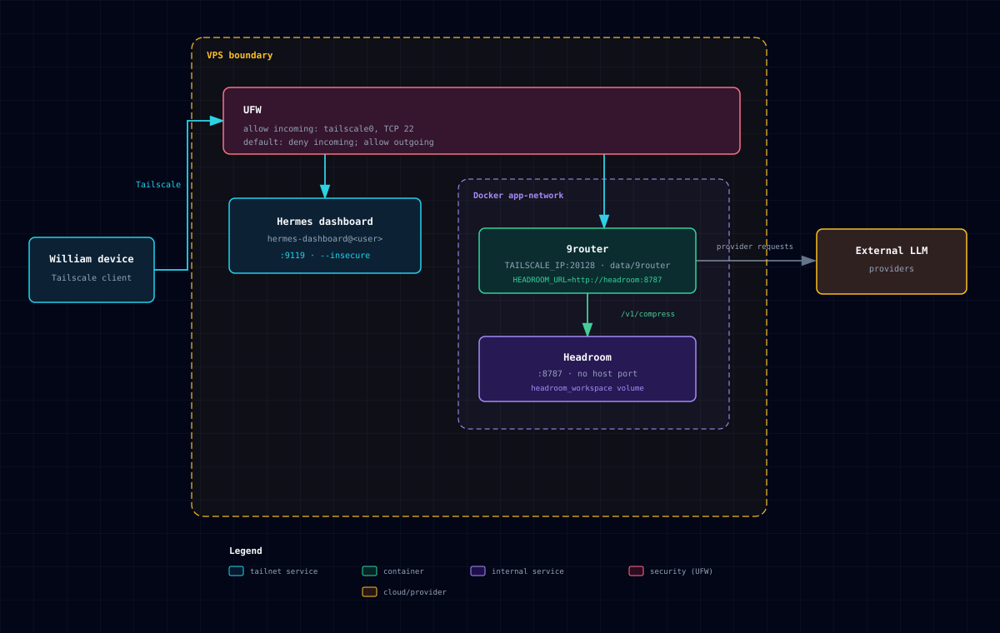

# personal-agent-infra

VPS infrastructure for Hermes Agent dashboard, 9router LLM router, and Headroom prompt-compression sidecar.



Interactive version with summary cards: [docs/architecture.html](docs/architecture.html). Ownership and agent rules live in [AGENTS.md](AGENTS.md).

## Components

| Component | Runs as / network | Reach it at |
|---|---|---|
| Hermes dashboard | `hermes-dashboard@<user>` systemd template | `http://<tailscale-ip>:9119` |
| 9router | Docker container; published host port | `http://<tailscale-ip>:20128` |
| Headroom | Docker `app-network` only | `http://headroom:8787` |

## Quick start

```bash
./scripts/init.sh
cp .env.example .env
# Fill NINEROUTER_* secrets and TAILSCALE_IP (from `tailscale ip -4`) in .env.
docker compose up -d
./scripts/deploy.sh [user]
./scripts/menu.sh
```

`init.sh` runs install steps in order and skips finished steps. `deploy.sh` selects one dashboard user because only one process can listen on `:9119`.

## Scripts

| Script | Purpose |
|---|---|
| `scripts/init.sh` | Run all or selected idempotent install steps. |
| `scripts/deploy.sh [user]` | Link units and switch dashboard user. |
| `scripts/menu.sh` | Whiptail control panel for status, deploy, logs, installs, and Hermes sudo. |
| `scripts/check-headroom.sh` | Read-only 9router-to-Headroom smoke test. |
| `scripts/hermes-sudo.sh on\|off\|status` | Manage Hermes passwordless sudo grant. |
| `scripts/install/00-system.sh` | Update system packages. |
| `scripts/install/10-docker.sh` | Install Docker and add current user to `docker`. |
| `scripts/install/20-tailscale.sh` | Install and connect Tailscale. |
| `scripts/install/30-zsh.sh` | Install Zsh and Oh My Zsh. |
| `scripts/install/40-firewall.sh` | Configure UFW. |
| `scripts/install/50-hermes-user.sh` | Create non-root `hermes` user and copy SSH keys. |
| `scripts/install/60-hermes-agent.sh` | Install Hermes Agent for `hermes`. |
| `scripts/install/70-headroom.sh` | Reconcile Headroom and 9router containers. |

## Security

- UFW denies incoming traffic by default; it allows `tailscale0` and TCP `22`.
- Dashboard uses `--insecure` on `0.0.0.0`; safety relies on UFW.
- 9router is published only on `TAILSCALE_IP`; Docker-published ports bypass UFW, so never bind `0.0.0.0`.
- Headroom must not publish host port or Tailscale Serve rule; 9router calls `/v1/compress` without token.
- `scripts/hermes-sudo.sh` grant and `docker` group membership are root-equivalent.
