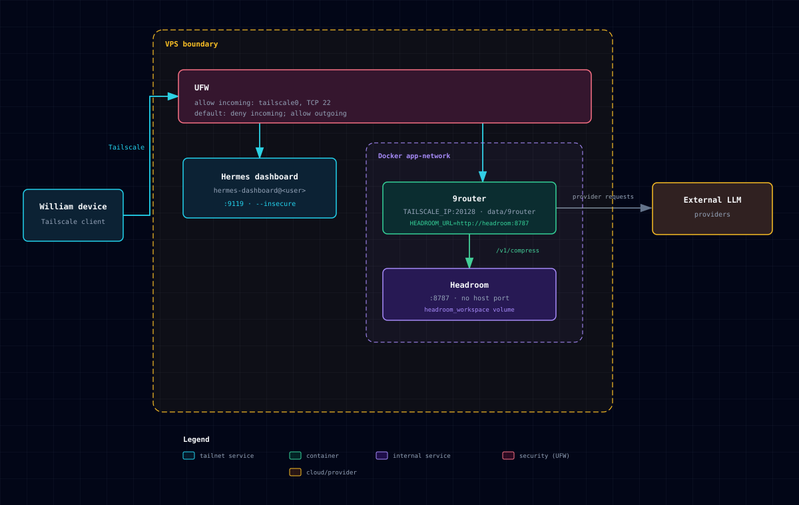

# personal-agent-infra

VPS infrastructure for Hermes Agent dashboard, Butler dashboard and API, 9router LLM router, and Headroom prompt-compression sidecar.



Interactive version with summary cards: [docs/architecture.html](docs/architecture.html). Ownership and agent rules live in [AGENTS.md](AGENTS.md).

## Components

| Component | Runs as / network | Reach it at |
|---|---|---|
| Hermes dashboard | `hermes-dashboard@<user>` systemd template | `http://<tailscale-ip>:9119` |
| 9router | Docker container; published host port | `http://<tailscale-ip>:20128` |
| Headroom | Docker `app-network` only | `http://headroom:8787` |
| Butler dashboard + API | Compose project `butler` from configured `BUTLER_DIR/compose.yml`; backend joins core Docker network only for 9router | Tailscale HTTPS `:8444` -> host loopback `:3100` |

## Quick start

> **Prerequisite:** Install Git and configure GitHub SSH access before cloning or deploying.
>
> ```bash
> sudo apt update && sudo apt install -y git openssh-client
> ssh-keygen -t ed25519 -C "you@example.com"
> cat ~/.ssh/id_ed25519.pub
> # Add output at https://github.com/settings/ssh/new, then verify:
> ssh -T git@github.com
> ```

```bash
# Open guided setup. It installs whiptail if missing.
./scripts/menu.sh
```

Choose **Set up new VPS (guided)**. Flow runs prerequisite steps, pauses until dotenvx private key is restored at `/etc/dotenvx/personal-agent-infra.env.keys` with owner `root:root` and mode `0600`, completes idempotent bootstrap, chooses dashboard user, deploys it, then runs Headroom smoke check.

Manual recovery path:

```bash
./scripts/init.sh dotenvx
./scripts/init.sh
./scripts/deploy.sh [user]
```

`init.sh` runs install steps in order and skips finished steps. `65-dotenvx` installs the dotenvx CLI and its global git clean filter. `75-services` writes root-owned `/etc/personal-agent-infra.paths` with non-secret `BUTLER_DIR` and `WIKI_DIR`; it defaults to `/home/hermes/services/{butler,second-brain-wiki}`. Set both absolute variables before first bootstrap to use another checkout base. `70-headroom` and `81-butler-dashboard` decrypt the committed, dotenvx-encrypted `.env` into `/etc/personal-agent-infra.env` before using it; it is a root-owned regular file, never a symlink to repo `.env`. `deploy.sh` selects one dashboard user because only one process can listen on `:9119`.

## Scripts

| Script | Purpose |
|---|---|
| `scripts/init.sh` | Run all or selected idempotent install steps. |
| `scripts/deploy.sh [user]` | Link units and switch dashboard user. |
| `scripts/menu.sh` | Whiptail control panel for status, deploy, logs, installs, and Hermes sudo. |
| `scripts/check-headroom.sh` | Read-only 9router-to-Headroom smoke test. |
| `scripts/hermes-sudo.sh on\|off\|status` | Manage Hermes passwordless sudo grant. |
| `scripts/butler.sh up\|restart\|down\|status\|logs` | Scoped Butler Compose control; `up` rebuilds images and exports host CLI. |
| `scripts/dotenv-env.sh render\|status` | Decrypt committed `.env` into `/etc/personal-agent-infra.env`, or report setup status without values. |
| `scripts/install/00-system.sh` | Update system packages. |
| `scripts/install/10-docker.sh` | Install Docker and add current user to `docker`. |
| `scripts/install/20-tailscale.sh` | Install and connect Tailscale. |
| `scripts/install/30-zsh.sh` | Install Zsh and Oh My Zsh. |
| `scripts/install/40-firewall.sh` | Configure UFW. |
| `scripts/install/50-hermes-user.sh` | Create non-root `hermes` user and copy SSH keys. |
| `scripts/install/65-dotenvx.sh` | Install dotenvx CLI and its global git clean filter. |
| `scripts/install/70-headroom.sh` | Render runtime environment, then reconcile Headroom and 9router containers. |
| `scripts/install/75-services.sh` | Clone Butler and second-brain-wiki. Defaults to `/home/hermes/services/{butler,second-brain-wiki}`; override once with absolute `BUTLER_DIR` and `WIKI_DIR`. |
| `scripts/install/80-butler-data.sh` | Create `/var/lib/butler`, task-tracker data dir shared by `hermes` and `ubuntu` (ACLs). |
| `scripts/install/81-butler-dashboard.sh` | Link `/var/lib/butler/wiki`, persist Tailscale Serve `:8444`, and start Butler Compose. |

## Secrets

`.env` at repo root IS committed to this public repo, and that is intentional: it holds [dotenvx](https://dotenvx.com)-encrypted values (`KEY=encrypted:...`), not plaintext. The only secret-bearing file is the private key at `/etc/dotenvx/personal-agent-infra.env.keys`, root-owned mode `0600`, generated once on the VPS and never committed, copied off the VPS, or placed in the repo. `scripts/install/65-dotenvx.sh` installs the dotenvx CLI and a global (machine-level) git clean filter (`dotenvx protect`) that blocks committing a plaintext `.env*` on this machine as a safety net.

`scripts/dotenv-env.sh render` (root only) decrypts `.env` using the private key, drops its stale `TAILSCALE_IP`/`BUTLER_ORIGIN`/`BUTLER_WEB_ORIGIN` lines, injects current host-derived values for those three, and atomically installs root-owned `/etc/personal-agent-infra.env` mode `0600`. It never prints secret values. `70-headroom` and `81-butler-dashboard` call it automatically. `scripts/dotenv-env.sh status` reports CLI/key/render state without values.

### Restore key from old VPS

Guided setup offers two steps under **Restore dotenvx private key**:

1. **Show one-time authorization command for old VPS**: generates (once) a dedicated, passphrase-less SSH key at `~/.ssh/id_ed25519_dotenvx_restore` on this VPS, then prints commands to run in an authenticated console on the old VPS. Those commands append one `authorized_keys` line restricted with `restrict,command="sudo -n /usr/bin/cat /etc/dotenvx/personal-agent-infra.env.keys"` — no shell, no port/agent forwarding, no other command — and add one scoped `/etc/sudoers.d/90-dotenvx-key-restore` entry permitting only that exact `cat`. Run those commands yourself on the old VPS; this repo never automates writes to a host it doesn't already trust.
2. **Copy directly from trusted old VPS over SSH**: enter the source target, e.g. `ubuntu@old-vps`. The dedicated key authenticates; password and keyboard-interactive auth are disabled; an unknown host fingerprint requires explicit terminal acceptance. The helper streams the key into a root-only temporary file, proves it decrypts committed infra `.env`, then atomically installs `/etc/dotenvx/personal-agent-infra.env.keys` as `root:root` mode `0600`. Failed transfer leaves any existing destination key unchanged.

After a successful transfer, remove the `authorized_keys` line and `/etc/sudoers.d/90-dotenvx-key-restore` from the old VPS; the restore key never grants anything beyond reading that one file.

To add or rotate a secret, an administrator with the encrypted `.env` checked out runs, on a trusted terminal, never in chat:

```bash
dotenvx set SOME_KEY 'the-value' -f .env
```

This re-encrypts in place using the public key already embedded in `.env`'s header; it does not require the private key and does not decrypt anything else in the file. Commit the updated ciphertext normally, then request an approved `scripts/dotenv-env.sh render` run on the VPS. Keep `TAILSCALE_IP`, `BUTLER_ORIGIN`, and `BUTLER_WEB_ORIGIN` out of manual edits; the renderer supplies them from live host state.

To inspect decrypted values locally (admin only, never for agents):

```bash
dotenvx decrypt -f .env -fk /etc/dotenvx/personal-agent-infra.env.keys --stdout
```

## Security

- UFW denies incoming traffic by default; it allows `tailscale0` and TCP `22`.
- Dashboard uses `--insecure` on `0.0.0.0`; safety relies on UFW.
- 9router is published only on `TAILSCALE_IP`; Docker-published ports bypass UFW, so never bind `0.0.0.0`.
- Headroom must not publish host port or Tailscale Serve rule; 9router calls `/v1/compress` without token.
- `scripts/hermes-sudo.sh` grant and `docker` group membership are root-equivalent.
- Butler runs only through configured `BUTLER_DIR/compose.yml`; host ports remain loopback. Backend joins `personal-agent-infra_app-network` only for 9router; frontend stays private.
- `/var/lib/butler` is shared through named ACLs by `hermes` and `ubuntu`. Butler container runs as root only for portable bind-mount ownership; do not add `hermes` to Docker group.
